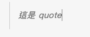
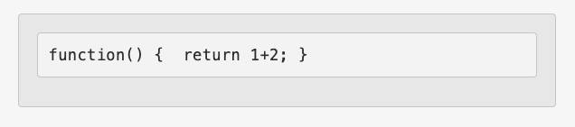
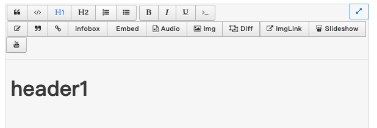
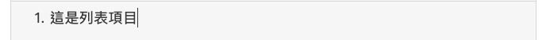
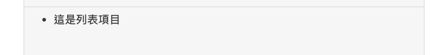
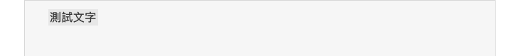
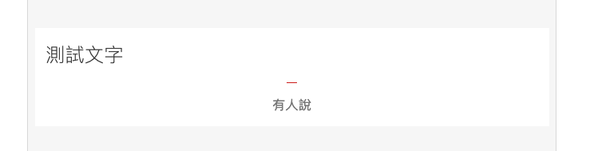
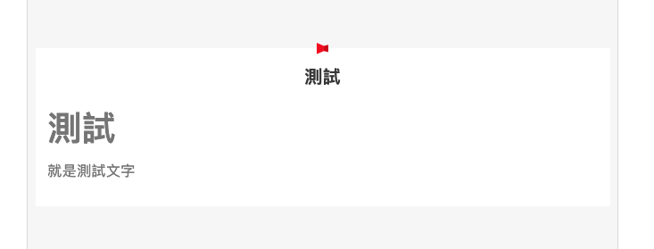
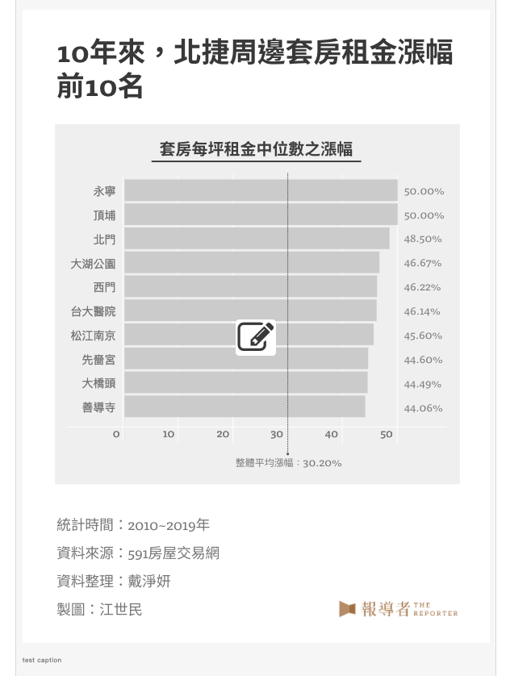
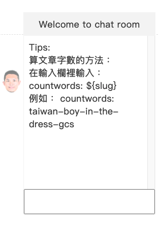

## 測試 Posts 頁面

### go to  `/keystone/posts` 

---

#### 測試 Search 功能：
1. 在 Search 的輸入框中，輸入文字`covid-19` 
2. 確認畫面中的 Posts 列表中，列出的文章的`網址名稱（英文）`包含`covid-19`字串。

---

#### 測試 Columns 功能
點選 Columns 按鈕後，會出現多個欄位，包含：
1. `標題`
2. `副標`
3. `狀態`
4. `發佈日期`
5. `作者`
6. `攝影`
7. `設計`
8. `工程`
9. `作者（其他）`
10. `置頂影片`
11. `首圖`
12. `首圖尺寸`
13. `首圖（Portrait）`
14. `首圖圖說`
15. `前言`
16. `內文`
17. `分類`
18. `文章樣式`
19. `專題`
20. `版權使用`
21. `標籤`
22. `相關文章`
23. `分享標題`
24. `分享說明`
25. `分享縮圖`
26. `自動推播`
27. `另開新頁`
28. `置頂`
29. `Preview`

其中 `標題`、`狀態`、`發佈日期`、`分類`和`Preview`預設是打勾的狀態，而其他則是尚未打勾的狀態。

##### 列表裡列出`作者`欄位
1. 打勾`作者`
2. 按下 Apply 按鈕
3. 檢查列表中，是否出現`作者`欄位
4. 若出現，代表正常，反之則否

---

#### 測試 Filter 功能：
點選 Filter 按鈕，會出現多個欄位，包含：
1. `標題`
2. `副標`
3. `狀態`
4. `發佈日期`
5. `作者`
6. `攝影`
7. `設計`
8. `工程`
9. `作者（其他）`
10. `置頂影片`
11. `首圖`
12. `首圖尺寸`
13. `首圖（Portrait）`
14. `首圖圖說`
15. `前言`
16. `內文`
17. `分類`
18. `文章樣式`
19. `專題`
20. `版權使用`
21. `標籤`
22. `相關文章`
23. `分享標題`
24. `分享說明`
25. `分享縮圖`
26. `自動推播`
27. `另開新頁`
28. `置頂`
29. `Preview`

##### 列表 filtered by `標題`
1. 點選`標題`
2. 選擇`Matches`選項
3. 選擇`Contains`選項
4. 在輸入框中，輸入文字 `covid-19`
5. 按下 Apply 按鈕
6. 列表會被過濾，只秀出`標題`中包含`covid-19`字串的資料列

##### 列表 filtered by `發佈日期`
1. 點選`發佈日期`
2. 選擇 `Matches` 選項
3. 選擇 `On` 選項
4. 在日期表裡選擇欲查詢的發佈日期。舉例而言，在日期表裡挑選2020年8月18日 
5. 按下 Apply 按鈕
6. 列表會被過濾，只秀出`發佈日期`是`2020-08-18`的文章

---

#### 新增 Post
1. 點選 `+ Create Post` 按鈕
2. 在輸入框中輸入`test-slug`
3. 按下 Create 按鈕
4. 畫面會出現 `New Post test-slug created.`

--- 

#### 更新 Post
1. 根據「[新增 Post](#新增-post)」，產生一筆測試文章資料
2. 標題: 輸入`測試文章標題`
3. 副標：輸入`測試文章副標題`
4. 狀態: 維持`Draft`
5. 作者：選擇`柯皓翔`
6. 攝影：選擇`余志偉`
7. 設計：選擇`林珍娜`
8. 工程：選擇`方泰鈞`
9. 作者（其他）： 輸入`共同採訪：王儀君`
10. 首圖：點選`Select Photo`，選擇第一張照片
11. 首圖：點選`Select Photo`，選擇第二張照片
12. 首圖圖說：輸入`大爆炸過後滿目瘡痍的貝魯特港灣區。（攝影／REUTERS／Mohamed Azakir／達志影像）`
13. 前言：輸入`離爆炸還不到48小時，一些黎巴嫩青年已等不及政府收拾災害殘局，他們在緊急狀態下再次走上街頭，揮舞雪松國旗、於國會前抗議，要求政府下台。黎巴嫩首都貝魯特在8月4日發生至今超過150人死亡、5,000人受傷，威力相當於數十顆炸彈之母的爆炸，讓黎巴嫩進入緊急狀態，並面臨可能的斷糧情況。曾於黎巴嫩採訪的《報導者》特約記者陳映妤，透過越洋採訪5位當地人和專家，理解爆炸現場及危機背後的黎巴嫩結構性問題，也看見人民在災難中的行動，甚至對一些青年來說，災難再次激起了自去年10月以來，他們發起公民抗命的動力。`
14. 內文：輸入`黎巴嫩8月4日當地下午6時，29歲的敘利亞籍媒體工作者阿爾哈瓦里 （Bassam Alhawari ）正騎著腳踏車前往首都貝魯特，準備到朋友家進行拍攝工作。正當他靠近貝魯特港口時，先是注意到不遠處開始起火，接著是第一聲爆炸，伴隨著黑煙與閃光。他直覺有更危險的事即將發生，周圍的人也開始大喊快逃。但還是太慢，幾秒後第二個更大的爆炸鋪天蓋地而來。

「我在距離港口200公尺外，整個人飛了出去，我目睹著眼前的男子直接在空中被炸碎，當場死亡。我剛好前面有個柱體物救了我一命。我腦中第一時間想的是我朋友和他的女兒有沒有事，但爆炸後幾分鐘內完全沒有手機訊號，我試著撥打幾次電話後，回過神來，才發現我的四肢和臉全部是血。」

2,750噸硝酸銨大爆炸，30萬人流離失所
黎巴嫩首都貝魯特的港口區域當天發生巨大的爆炸，波及方圓約10公里的區域，甚至遠在200公里外、隔了一個海峽的賽普勒斯，都感覺得到爆炸的威力。

爆炸影響所及，隨處可見滿地的碎裂玻璃、崩塌的建築物、被轟炸到扭曲變形的車體，以及死亡與受傷人們的血跡。根據黎巴嫩衛生部統計，目前大爆炸導致的死亡人數已上升到至少157人，超過5,000人受傷，目前仍有人被埋在瓦礫堆下，社群媒體上還有人在尋找失散的家人或朋友。據《紐約時報》（The New York Times）報導，大約有75萬人居住在爆炸波及的範圍，而自爆炸發生後，已有至少30萬名貝魯特居民流離失所。

阿爾哈瓦里在朋友趕到現場後，被送往藥局，因為他知道貝魯特的醫院應該皆已超出負荷，便自行在藥局止血包紮。阿爾哈瓦里後來得知朋友和他的女兒，都因重傷在醫院急救。

去年（2019）6月，我一度到黎巴嫩做採訪，阿爾哈瓦里被炸傷的港口所在，就是我曾經與友人吃冰散步的地方；在引爆港口的幾條街外，是當時我拜訪另外兩位朋友的住處。黎巴嫩是個靠地中海東岸的中東國家，面積約是台灣的三分之一大，人口約680萬人，2019年的人均GDP（以購買力平價計算）是15,327美元，相對其他中東國家，黎巴嫩現代化程度高，受西方文化薰陶，人民擁有高教育水準。貝魯特因其豐富的文化，被形容為「中東巴黎」。爆炸發生的那一帶，更是繁華文明的標誌，特色酒吧和時尚文藝小店林立，是許多文青聚集之地。

然而，這一切在一夕之間灰飛煙滅，當局於爆炸後，宣布貝魯特為「災難城市」。`

15. 分類：選擇`國際．兩岸`
16. 點選置底的`Save`按鈕
17. 畫面會出現 `Your changes have been saved`

--- 

#### 檢查編輯器

##### 檢查複製貼上功能
1. 複製一段純文字
2. 能成功貼至目的區塊

##### 檢查-inline-style-buttons
###### 檢查 quote
1. 輸入文字「這是 quote」
2. 點擊 quote 按鈕
3. 文字樣式如下圖所示

###### 檢查 code block 
1. 輸入文字 `function() {  return 1+2; }`
2. 點擊 code block 按鈕
3. 樣式如下圖所示

###### 檢查 H1 
1. 輸入文字「Header1」
2. 點擊 H1 按鈕
3. 文字顯示為H1樣式

###### 檢查 H2 
1. 輸入文字「Header2」
2. 點擊 H2 按鈕
3. 文字顯示為H2樣式

###### 檢查列表(ordered list, unordered list) 
1. 輸入文字「這是列表項目」
2. 點擊 ordered list 按鈕
3. 顯示 ordered list 樣式（如圖）

4. 再次點擊 ordered list 按鈕，取消 ordered list 樣式
5. 點擊 unordered list 按鈕
6. 顯示 unordered list 樣式（如圖）

7. 再次點擊 unordered list 按鈕，取消 unordered list 樣式

###### 檢查粗體、斜體、底線、標註（monospace）
1. 依序點擊粗體、斜體、底線、標註，並檢查字體是否正確，其中標註（monospace）樣式如圖:

 

##### 檢查 entity buttons

###### 檢查-link
1. 點擊 link button
2. 在跳出的 insert link 對話框填入文字與超連結，新增一個 link
3. 對現有的字串反白，再點擊 link button
4. 在跳出的 insert link 對話框中，連結文字為前項之反白文字，接續執行第2項

###### 檢查 annotation（註解）
1. 點擊 annotation button
2. 在註解內容區塊 [檢查複製貼上功能](#檢查複製貼上功能)
3. 在註解內容區塊 [檢查 inline style buttons](#檢查-inline-style-buttons)
4. 在註解內容區塊 [檢查 link](#檢查-link)
5. 按 Save 新增 annotation
6. 對現有的字串反白，再點擊 annotation button
7. 在跳出的 insert annotation 對話框中，text 顯示前項之反白文字，接續執行第5項 

###### 檢查 blockquote
1. 點擊 blockquote button
2. [檢查複製貼上功能](#檢查複製貼上功能)
3. 填入quoteBy, quote
4. 按 Save 新增 blockquote，樣式如下圖
 

5. 對現有的字串反白，再點擊 blockquote button
6. 在跳出的 insert blockquote 對話框中，quote 顯示前項之反白文字，接續執行第4項 

###### 檢查 infobox 
1. 點擊 infobox button
2. 填入title
3. 在內容區塊 [檢查複製貼上功能](#檢查複製貼上功能)
4. 在內容區塊 [檢查 inline style buttons](#檢查-inline-style-buttons)
5. 在內容區塊 [檢查 link](#檢查-link)
6. 按 Save 新增 infobox，樣式如下圖

7. 對現有的字串反白，再點擊 infobox button
8. 在跳出的 insert infobox 對話框中，title 顯示前項之反白文字，接續執行第6項 

###### 檢查 Embed 
1. 點擊 Embed button
2. 填入 caption
3. 貼上下方文字於 embeddedCode 區塊

`

`

4. 按 Save 新增 embedded code block，編輯器顯示如下圖:

 

5. 在 embedded code block 下方輸入中文字新增段落，確認畫面不會跳動

###### 檢查 Audio 
1. 點擊 Audio button
2. 選擇一個音檔：【倖存者的餘聲】夏雪想對姊姊說的話
3. 在音檔區塊下方輸入中文字新增段落，確認音檔無閃動

###### 檢查 Image 
1. 點擊 Img button
2. 選擇第一張照片
3. 在照片下方輸入中文字新增段落，確認照片無閃動

###### 檢查 Image Diff 
1. 點擊 Diff button
2. 選擇前兩張照片
3. 在照片下方輸入中文字新增段落，確認區塊無閃動

###### 檢查 Image Link 
1. 點擊 ImgLink button
2. 輸入 url, description，按 Save 
3. 在圖片下方輸入中文字新增段落，確認圖片無閃動

###### 檢查 slideshow 
1. 點擊 slideshow button
2. 選擇五張照片
3. 在照片下方輸入中文字新增段落，確認 thumbnails 不會重新載入，確認畫面無閃動

###### 檢查 Youtube 
1. 點擊 youtube button
2. 填入 youtubeId, description，按 Save 
3. 在影片下方輸入中文字新增段落，確認影片不會重新載入，確認畫面無閃動

--- 

#### Preview Post
1. 根據「[更新 Post](#更新-post)」，產生測試文章
2. go to https://keystone-preview.twreporter.org/a/test-slug
3. 檢查頁面上的資訊是否正確

---

#### 檢查聊天室
1. 根據「[更新 Post](#更新-post)」，產生測試文章
2. 畫面會停留在該篇新增文章的頁面
3. 確認畫面右方是否出現聊天室(如圖)

 

---

#### 刪除 Post
1. 根據「[新增 Post](#新增-post)」，產生測試文章
2. 到 Posts 列表頁 (`/keystone/posts`)
3. 找到`網址名稱（英文）`是`test-slug`的資料列
4. 點選資料列前的垃圾桶 icon
5. 點選`Delete`按鈕
6. 確認列表中，沒有`網址名稱（英文）`是`test-slug`的資料列

---
